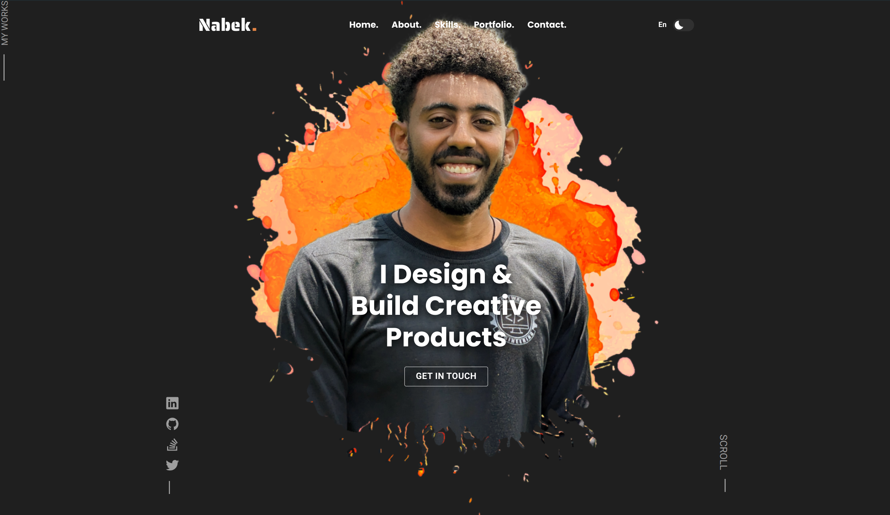

<div align="center">  
  

  <h2 align="center">Nabek - Personal portfolio</h2>

<a href="https://nabekabebe.github.io/Personal-Portfolio/"><strong>➥ Live Demo</strong></a>

</div>

<br />

### Demo Screeshots



### Run Locally

To run **Nabek-portfolio** locally, run this command on your git bash:

Linux and macOS:

```bash
sudo git clone https://github.com/nabekabebe/Personal-Portfolio.git
```

Windows:

```bash
git clone https://github.com/nabekabebe/Personal-Portfolio.git
```

### Contact

If you want to contact with me you can reach me at [LinkedIn](https://www.linkedin.com/in/nabek-abebe-217b84193/).
